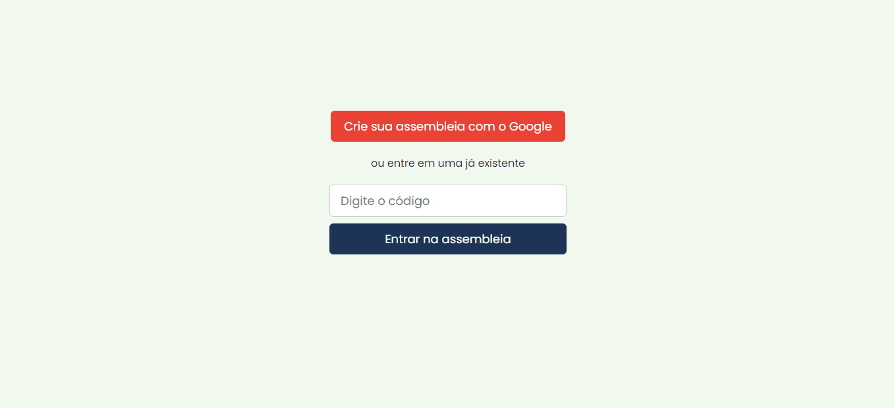

<section align="center">
    <h1>TEN MEETINGS</h1>
</section>

---

<h2 align="center">Summary</h2>

    <a href="#about">📙 About</a>
    <a href="#preview">🖼️ Preview</a>
    <a href="#requirements">💡 Requirements</a>
    <a href="#technologies">💻 Technologies</a>

<h4 align="center">
   ✔️ Ten Meetings project finished ✔️
</h4>

<H2 id="about">📙 About</H2>

Ten Meetings is a company that provides meeting services to publicly traded companies. The meetings have several agendas and participants.

<ul>
<li>The meeting has some features, such as name and status. A meeting can be in active or inactive status. Only active meetings can have voted agendas.</li>
<li>The agenda has some features, such as name and total number of votes. An agenda can only be voted once per participant.</li>
<li>The participant has a name and an array of votes. Each participant can vote only once on each agenda.</li>
</ul>

The challenge is to create an algorithm that is able to open an meeting, open an agenda, allow the participant to vote on an agenda, perform the vote count for each agenda.

Challenge idealized by Ten Meetings and executed by <a href="https://www.linkedin.com/in/kleverson-kenji-iwatani/">Kenji Iwatani</a>

    <h3><a href="https://ten-meetings.web.app/">Check website &rarr;</a></h3>

---

<H2 id="preview">🖼️ Preview</H2>

<section align="center">
    
</section>

---

<H2 id="requirements">💡 Requirements</H2>

- [x] Should be able to open a meeting
- [x] Should be able to open an agenda
- [x] Should be able to allow the participant to vote on an agenda
- [x] Should be able to compute votes from each agenda
- [x] Only active meetings can have voted agendas
- [x] Each participant can vote only once per agenda

---

<H2 id="technologies">💻 Technologies</H2>

- [x] <a href="https://www.typescriptlang.org/">Typescript</a>
- [x] <a href="https://create-react-app.dev/">Create React App</a>
- [x] <a href="https://sass-lang.com/">SASS</a>
- [x] <a href="https://firebase.google.com/">Firebase</a>